<p align="center">
  <picture><source media="(prefers-color-scheme: dark)" srcset="docs/assets/brand/logo-dark.svg"></picture>
</p>

<h3 align="center">Decisions for real-world cases.</h3>

<p align="center">Small open models (2B · 4B · 9B) that read the photos, records and text a business already has and answer in the options you set,<br>
with a probability on each and an explicit <i>can't tell</i>. Your system acts when it is sure and hands the rest to a person.</p>

<p align="center">
  <a href="LICENSE"></a>
  <a href="https://huggingface.co/mohit67890/imajev-4b"></a>
  <a href="https://huggingface.co/datasets/mohit67890/imajev-bench"></a>
</p>

<p align="center"><a href="https://huggingface.co/spaces/mohit67890/imajev"></a></p>

<p align="center"><a href="https://huggingface.co/spaces/mohit67890/imajev"><b>Live demo</b></a> · <a href="https://mohit67890.github.io/imajev/"><b>Website</b></a> · <a href="#quickstart">Quickstart</a> · <a href="#checked-not-cherry-picked">Checked examples</a> · <a href="#results">Results</a> · <a href="https://mohit67890.github.io/imajev/report/">Technical report</a></p>

<p align="center"><picture><source media="(prefers-color-scheme: dark)" srcset="docs/assets/readme/request-listing-dark.png">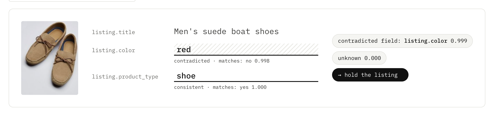</picture></p>

## Try it live

The [live demo](https://huggingface.co/spaces/mohit67890/imajev) runs imajev-4b on a GPU. Pick one of the checked examples
(a listing against its photo, a return, a part on the line, an email against a CRM record, a refund against the policy, a ticket,
a stylist request it declines to guess on), change the record or swap a photo, and watch the answer and the app's action change.
Or upload your own photo and write your own questions.

<p align="center"><a href="https://huggingface.co/spaces/mohit67890/imajev"><picture><source media="(prefers-color-scheme: dark)" srcset="docs/assets/readme/space-dark.png">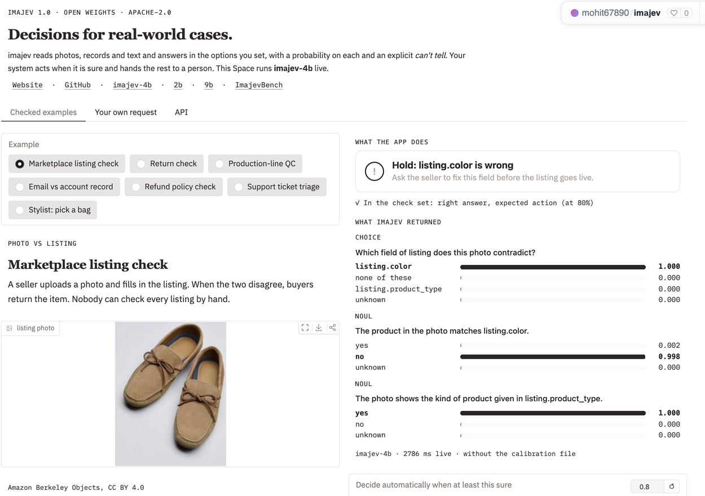</picture></a></p>

## One request, every answer typed

Send the evidence and the questions you care about. Each answer comes back as a probability over the answers you allowed, ready
for an `if`. This is the exact script we ran against imajev-4b (`site/showcase/listing.py`) and its output, with numbers rounded to
three places and `usage` shortened; 1.15 s on a Mac Studio (four option orders averaged, calibration file applied).

```python
import json, requests

URL = "http://127.0.0.1:8765/v1/systemone"

listing = {
    "title": "Men's suede boat shoes",
    "color": "red",
    "product_type": "shoe",
}

questions = {
    "contradicted_field": {
        "type": "choice",
        "instructions":
            "Which field of `listing` does this photo contradict?",
        "criteria": {
            "listing.color": None,
            "listing.product_type": None,
            "none of these": "the photo agrees with every field",
        },
    },
    "color_matches": {
        "type": "noul",
        "instructions":
            "The product in the photo matches `listing.color`.",
    },
    "type_matches": {
        "type": "noul",
        "instructions": "The photo shows the kind of product "
                        "given in `listing.product_type`.",
    },
}

request = {"state": {"listing": listing}, "questions": questions}
with open("listing.jpg", "rb") as photo:
    r = requests.post(URL, files={"image": photo},
                      data={"request": json.dumps(request)})
print(json.dumps(r.json(), indent=2))
```

<details><summary>Result</summary>

```json
{
  "model": "imajev-4b",
  "answers": {
    "contradicted_field": {
      "type": "choice",
      "choice": "listing.color",
      "probabilities": {
        "listing.color": 0.95,
        "listing.product_type": 0.006,
        "none of these": 0.043
      },
      "confidence": 0.919,
      "unknown_probability": 0.007,
      "abstained": false
    },
    "color_matches": {
      "type": "noul",
      "noul": 0.082,
      "unknown_probability": 0.022,
      "abstained": false
    },
    "type_matches": {
      "type": "noul",
      "noul": 0.989,
      "unknown_probability": 0.004,
      "abstained": false
    }
  },
  "usage": {
    "total_ms": 1152.9,
    "input_tokens": 224
  }
}
```
</details>

<p align="center"><picture><source media="(prefers-color-scheme: dark)" srcset="docs/assets/readme/request-ticket-dark.png">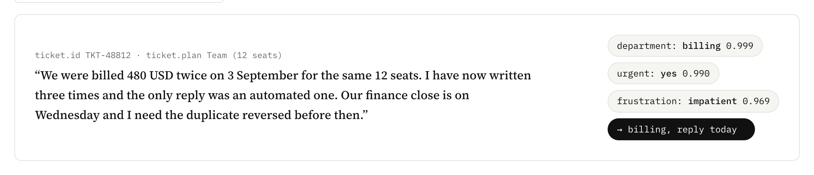</picture></p>
<p align="center"><sub>The same endpoint with no photo: one request routes the ticket (choice), flags urgency (yes/no) and scores frustration (score). Script: <code>site/showcase/ticket.py</code>.</sub></p>

## What sets it apart

Jev reads text only. General vision models answer in prose, from a hosted API, in seconds. imajev brings Jev's typed answers to
photos, and runs on your own hardware.

<picture><source media="(prefers-color-scheme: dark)" srcset="docs/assets/readme/highlights-dark.png">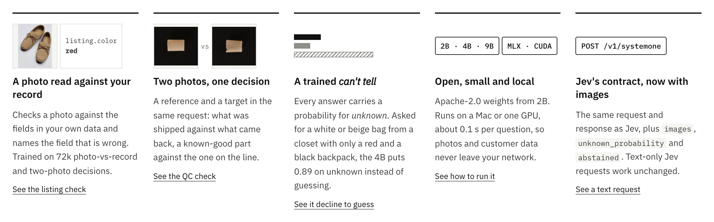</picture>

- **A photo read against your record.** Checks a photo against the fields in your own data and names the field that is wrong.
  Trained on 72k photo-vs-record and two-photo decisions.
- **Two photos, one decision.** A reference and a target in one request: what was shipped against what came back, a known-good
  part against the one on the line.
- **A trained *can't tell*.** Every answer carries a probability for `unknown`. Asked for a white or beige bag from a closet with only
  a red and a black backpack, the 4B puts 0.89 on unknown instead of guessing.
- **Open, small and local.** Apache-2.0 weights from 2B. A Mac or one GPU, about 0.1 s per question raw, about 0.3 s as shipped (four option orders averaged); photos and customer data never
  leave your network.
- **Jev's contract, now with images.** The same request and response as TypeSafe's Jev, plus `images`, `unknown_probability` and
  `abstained`. Text-only Jev requests work unchanged.

| | **imajev** | Jev (TypeSafe) | Jev-Omni | Frontier vision APIs |
|---|---|---|---|---|
| photos in a request | **up to 2 (reference + target)** | none, text only | yes; two-photo requests not documented | yes |
| answer format | **probability per option you set** | probability per option you set | probability per option you set | generated text or JSON |
| says it can't tell | **trained `unknown`, 14 / 21 on ImajevBench** | not documented | no abstain output, so 0 / 21 | only if prompted |
| record per request | **32 KB (about 8k tokens)** | 32k tokens | not documented | large |
| where it runs | **your hardware, open weights** | hosted API | your hardware, open weights (12B) | hosted API |
| time per decision | **about 0.1 s raw, about 0.35 s as shipped (one H100)** | not documented | about 0.1 s (one H100) | 5 to 8 s |
| ImajevBench accuracy | **82.4% (4B)** | cannot take photos | 78.5% | 91.4% to 99.6% |

<sub>Jev from docs.typesafe.ai (models page, Jev 1.13.0). Jev-Omni from its model card and our run of its own `predict()` API.
Frontier rows and all ImajevBench numbers from our runs, 24 Sept 2026; frontier models answer by structured generation, a different
interface. Jev's record limit is larger than imajev's.</sub>

## Where it fits

The decisions it handles well are the high-volume, well-defined ones with a clear set of answers.

| Area | Decisions (each a checked example on the [website](https://mohit67890.github.io/imajev/#uses)) |
|---|---|
| Marketplaces and retail | listing matches its photo · return is the item we shipped · tag a product from a photo |
| Manufacturing and field work | reject a chipped part against a known-good reference · spot what changed on site |
| Customer support | route a ticket and flag urgency · refund against the policy · send a review to the right team |
| Trust and safety | remove spam, harassment and doxxing · ask for a better photo |
| Back office and records | email contradicts the CRM · is the invoice paid? · catalogue record is wrong |

## Automate what is clear, route the rest

You choose how sure the model must be before it acts. A higher bar automates less and makes fewer mistakes; everything below it goes
to a person, including when it says it can't tell.

<picture><source media="(prefers-color-scheme: dark)" srcset="docs/assets/readme/automation-dark.png">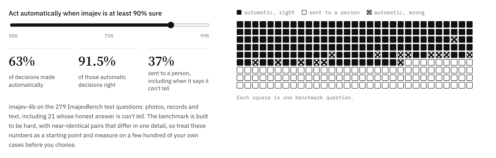</picture>

| Act when at least… | imajev-2b | imajev-4b | imajev-9b |
|---|---|---|---|
| 80% sure | 49% automated, 92.7% right | 64% automated, 91.6% right | 77% automated, 87.9% right |
| 90% sure | 38% automated, 95.3% right | 58% automated, 94.5% right | 70% automated, 91.8% right |
| 99% sure | 21% automated, 100% right | 42% automated, 99.1% right | 52% automated, 99.3% right |

<sub>The 279 ImajevBench test questions (photos, records and text; 21 whose honest answer is *can't tell*), raw probabilities,
scored with the benchmark's own rule (as shipped: four option orders, calibration file). The benchmark is built to be hard, so treat these as a starting point and measure on a few
hundred of your own cases before choosing.</sub>

## Checked, not cherry-picked

Every example comes from one of five small apps in `scripts/playground/`. Every combination a visitor can click in them is sent to
the model and compared with the right answer (`node scripts/playground/verify_scenarios.mjs`); a check passes when the answer is
right and the app takes the expected action at an 80% threshold. imajev-4b, served without its calibration file (four option orders):

| App | | What it asks | Passed | With the calibration file |
|---|---|---|---:|---:|
| 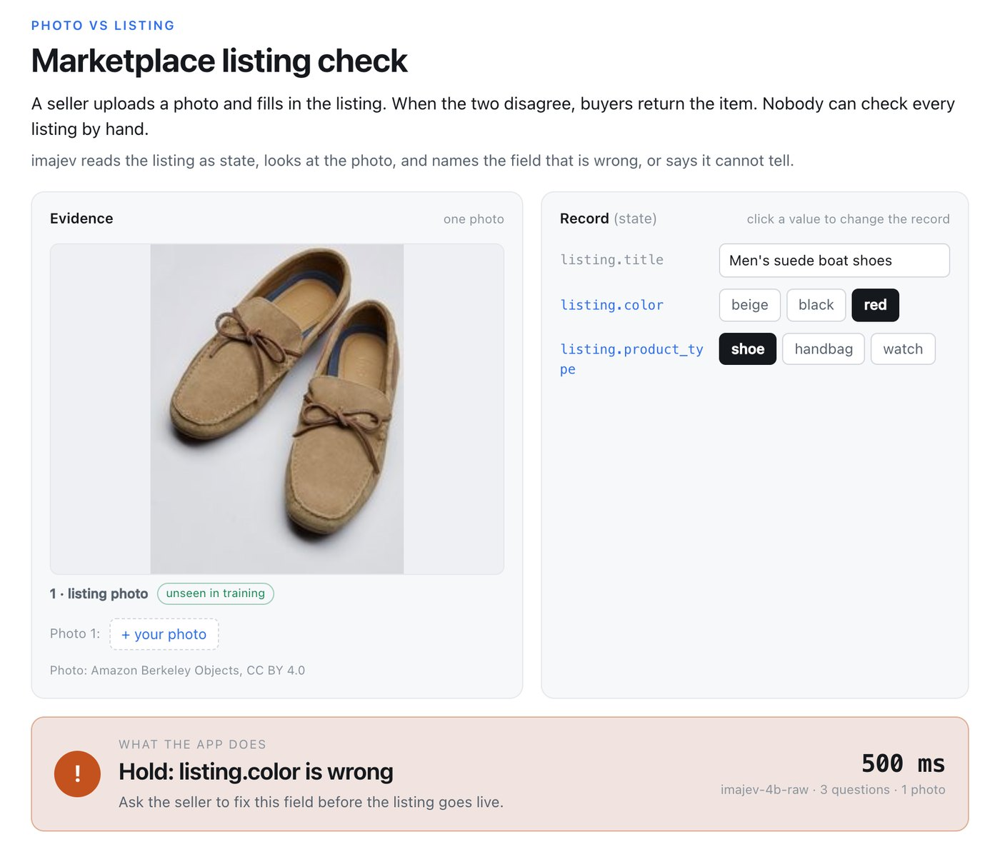 | **Business checks** | Does the photo match the listing? Is the return the item we shipped? Is this part chipped? | 19 / 21 | 19 / 21 |
| 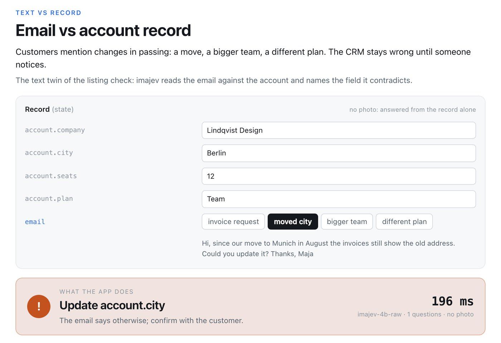 | **Text only** | An email against a CRM record, a refund against the policy, a post against forum rules, a review, an inbox. Written for the launch and run once. | 20 / 21 | 18 / 21 |
| 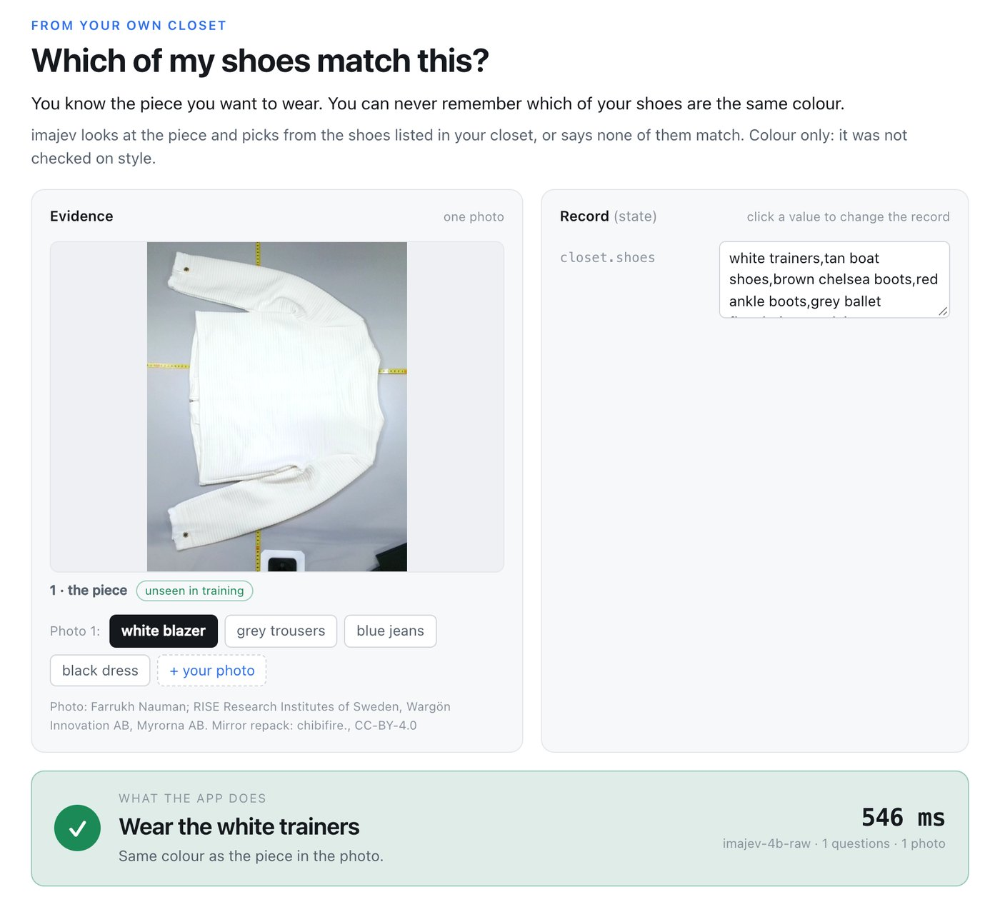 | **Wardrobe** | Is this what I ordered, does it meet the dress code, do I already own it, which shoes match? | 48 / 49 | 38 / 49 |
| 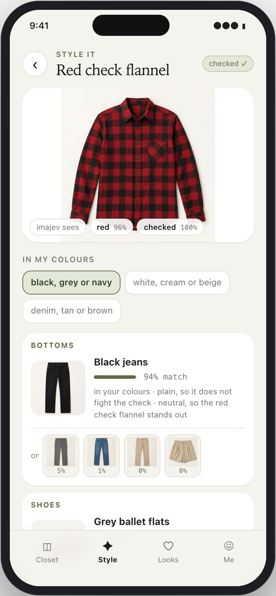 | **Stylist app** | Reads a piece of clothing, then picks bottoms, shoes and a bag from your closet in your colours. | 21 / 24 | 21 / 24 |
| 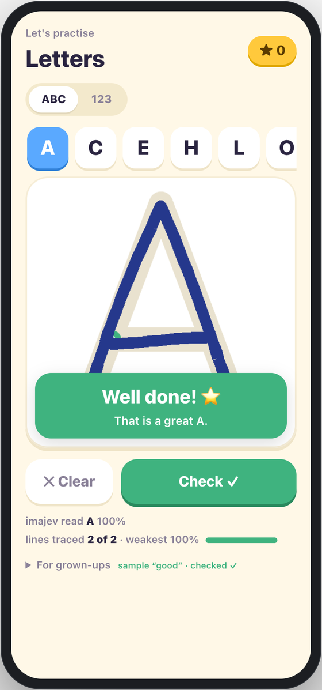 | **Tracing pad** | Reads which letter or number a child traced; the app checks the strokes covered every line. | 22 / 30 | 22 / 30 |
| | **All** | | **129 / 145** | **113 / 145** |

With the calibration file the top answer never changes, but confidence is lower, so more cases go to a person at 80%. The misses
worth knowing: with a blank payment note the 4B answered "not paid" instead of unknown, and it reads 8 of 10 scribbles on the tracing
pad as letters. Every run, pass or miss, is in `results/scenarios/`.

## Three sizes

| | **imajev-2b** (latency) | **imajev-4b** (recommended default) | **imajev-9b** (quality) |
|---|---|---|---|
| Base | Qwen3.5-2B (Apache-2.0) | Qwen3.5-4B (Apache-2.0) | Qwen3.5-9B (Apache-2.0) |
| Adapter | LoRA r16/α32 on the language layers + 255-code decision readout; vision tower frozen; shipped as a weight-space average of two adapters (the hard-question adapter and a soft-target continuation of it) | same | same |
| ImajevBench v2.0-lite test | 71.7% | 82.4% | 82.1% |
| JevBench public hard (111), as shipped (4 rotations + calibration) | 60.4% | 70.3% | 69.4% |
| p50 per decision, JevBench hard item, 1×H100, serial, under load | 238 ms as shipped (83 ms raw) | 350 ms (96 ms raw) | 316 ms (96 ms raw) |
| Use it when | latency or memory is the constraint | almost always: within noise of the 9B on ImajevBench | knowledge-heavy text questions, and memory is not a constraint (~19 GB resident) |
| Weights | [`mohit67890/imajev-2b`](https://huggingface.co/mohit67890/imajev-2b) | [`mohit67890/imajev-4b`](https://huggingface.co/mohit67890/imajev-4b) | [`mohit67890/imajev-9b`](https://huggingface.co/mohit67890/imajev-9b) |

Start with the 4B. On ImajevBench it is within noise of the 9B (82.4% vs 82.1%; the paired test gives p = 1.0) and one point ahead of it on
JevBench hard. The 2B is 11 points lower on ImajevBench and 10 lower on JevBench hard; pick it when its footprint is the point.
The Mac (MLX) weights agree with the GPU run on 97 to 99% of ImajevBench answers (2B 97.1%, 4B 98.2%, 9B 99.3%).

## Quickstart

```sh
git clone https://github.com/mohit67890/imajev && cd imajev
python3.11 -m venv .venv && source .venv/bin/activate
pip install -e ".[serve,mlx]"          # Apple silicon;  elsewhere: pip install -e ".[serve,torch]"
python scripts/download_model.py --model 4b          # pinned Qwen3.5-4B into .cache/
hf download mohit67890/imajev-4b --local-dir adapters/imajev-4b
PYTHONPATH=src:scripts python scripts/playground/server.py --model-bundle artifacts/model-qwen4b.json \
  --adapter adapters/imajev-4b/mlx --calibration adapters/imajev-4b/calibration.json --model-name imajev-4b --port 8765
```

Open http://127.0.0.1:8765/ for the playground, or call the API:

```sh
curl -s http://127.0.0.1:8765/v1/systemone \
  -F 'request={"state":{"listing":{"title":"Blue ceramic mug, 350 ml","colour":"blue"}},
               "questions":{"matches":{"type":"noul","instructions":"Does the photo show the listed item?"},
                            "wrong_field":{"type":"choice","instructions":"Which listing field does the photo contradict?",
                                           "criteria":{"title":null,"colour":null,"none":null}}}}' \
  -F image=@photo.jpg
```

```python
import requests
r = requests.post("http://127.0.0.1:8765/v1/systemone", json={
    "state": "Ticket: 'Charged twice for one order, need the duplicate refunded.'",
    "questions": {"queue": {"type": "choice", "instructions": "Route the ticket.",
                            "criteria": {"billing": None, "shipping": None, "account": None, "other": None}},
                  "urgency": {"type": "score", "instructions": "How urgent is this ticket?",
                              "criteria": ["can wait a week", "this week", "today", "within the hour", "right now"]}}})
print(r.json()["answers"]["queue"])   # {"type": "choice", "choice": "billing", "probabilities": {...}, "confidence": ..., "unknown_probability": ..., "abstained": false}
```

On Linux / CUDA, add `--backend torch` and pass `--adapter adapters/imajev-4b` (the PEFT adapter at the repo root). For the other
sizes, swap `4b` for `2b` or `9b` in the download commands, the bundle (`artifacts/model-qwen9b.json` for the 9B; the 2B is the
default bundle) and the adapter paths. `--rotations 4` averages four option orders; every number in this README was measured with it and with `--calibration` (on JevBench hard it adds +1.8 / +0.9 / +0.0 points for the 2B / 4B / 9B at about 3×
the latency). The 9B needs ~19 GB resident; do not keep it and another model loaded on the same Mac.

## For developers

**What comes back.** For each question: `choice` / `score` return `probabilities` over your options (summing to 1, given that the
model answers); `noul` returns P(yes) with half of the unknown mass added, as in Jev. Every answer also has `unknown_probability`
(mass on the trained *unknown*: missing, contradictory or out-of-scope evidence), `abstained` (unknown was the most likely outcome)
and `confidence`. Limits per request: up to 2 images, a state up to 32 KB, 1 to 8 questions, 2 to 254 options, 2 to 10 score levels.

**Acting on it.** Act above a threshold you choose from your own error costs; send abstentions and low-confidence answers to a person.

```python
a = response["answers"]["contradicted_field"]
p = a["probabilities"][a["choice"]] * (1 - a["unknown_probability"])
if a["abstained"] or p < 0.85:
    route_to_person(a)            # the model cannot tell, or is not sure enough
elif a["choice"] == "none of these":
    publish()
else:
    hold(field=a["choice"])
```

**Choosing a size.** Start with imajev-4b. Use the 2B when latency or memory is tight (it abstains less often than it should on
unknown items); use the 9B for knowledge-heavy text questions when ~19 GB of weights is fine.

**Checking it on your data.** Score a few hundred of your own labelled requests (include "cannot tell" cases) before trusting a
threshold. To fit your own temperature, the evaluators in `scripts/` write one JSONL row per question with its logits, and
`scripts/v1_text/fit_temperature_calibration.py rows.jsonl calibration.json` fits one temperature per question type and option count;
serve it with `--calibration`. The full guide is section 5 of the [technical report](https://mohit67890.github.io/imajev/report/#s5).

## Results

All numbers are from our runs on 2026-09-24 with the released adapters; the raw outputs and per-panel reports are in `results/`.
JevBench is a **text-only** benchmark; these are its public splits (111 hard / 72 original / 48 easy) run with the jevbench harness
and the typesafe adapter on one H100, as shipped (four option orders averaged, calibration file applied) unless stated; the pod was busy with other runs, so latencies are under load. **No official JevBench leaderboard number exists for imajev
yet**; a measurement will be requested at launch, and nothing below is one.

<picture><source media="(prefers-color-scheme: dark)" srcset="docs/assets/charts/imajevbench-dark.svg">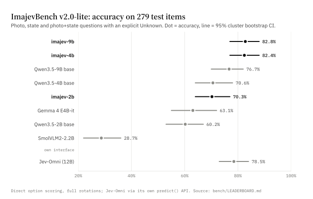</picture>

<picture><source media="(prefers-color-scheme: dark)" srcset="docs/assets/charts/jevbench-dark.svg">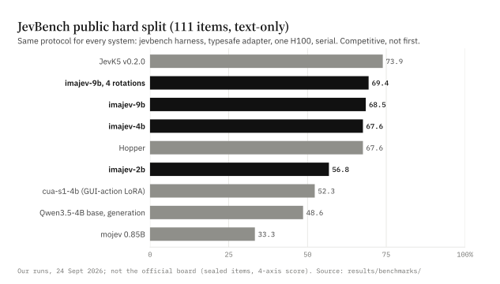</picture>

| Panel | imajev-2b | imajev-4b | imajev-9b | Same-protocol references |
|---|---:|---:|---:|---|
| ImajevBench v2.0-lite test (279), 95% cluster CI | 71.7% [0.65, 0.78] | 82.4% [0.77, 0.89] | 82.1% [0.76, 0.88] | untuned bases 60.2 / 70.6 / 76.7%; Jev-Omni 78.5% (its own API); other small VLMs in `bench/LEADERBOARD.md` |
| · correct Unknown (21) / false abstention (258) | 5 / 4 | 14 / 3 | 15 / 2 | |
| · hidden split (202 items, aggregates only) | 74.3% | 84.2% | 84.7% | |
| JevBench hard (111) | 60.4% | 70.3% | 69.4% | JevK5 v0.2.0 73.9%, Eikos-4B 73.9%, Hopper 67.6%, Qwen3.5-4B base (structured generation) 48.6%, mojev 0.85B 33.3% |
| JevBench original (72) / easy (48) | 93.1 / 100 | 98.6 / 100 | 100 / 100 | JevK5 97.2 / 100, Eikos-4B 93.1 / 100, Hopper 95.8 / 100 |
| JevBench hard ECE, raw → as shipped (rotations + `calibration.json`) | 0.176 → 0.123 | 0.164 → 0.116 | 0.187 → 0.092 | JevK5 0.073, Eikos-4B 0.054, Hopper 0.050 |
| MMLU-1000, text-only / with an unrelated photo | 59.8 / 54.9 | 74.5 / 72.9 | 79.2 / 78.8 | previous (phase-2b) adapters; not re-run on the shipped versions |
| Irrelevance panel (2,823) | 68.9% | 80.2% | 84.0% | |
| typed-decisions test (2,000) | 59.2% | 67.0% | 67.0% | previous (phase-2b) adapters; not re-run on the shipped versions |
| Reasoning dev (6,240; also used for checkpoint selection) | 58.9% | 66.6% | 67.4% | previous (phase-2b) adapters; the soft-target checkpoints inside the shipped averages score 62.7 / 67.2 / 68.9% and the averages were not measured; before the last part of the hard-question stage: 64.5 / 67.8 / 69.2% |

Reading:

- **Competitive on JevBench's public splits, not #1.** JevK5 and Eikos-4B are ahead of every imajev size on hard, by 3 to 4 items of 111; the 4B is above Hopper (70.3 vs 67.6). The gap to
  JevK5 is concentrated in judge-style items (previous 4B adapter: 10/17 vs JevK5 13/17 on judge_hard). A frozen Qwen3.6-35B-A3B *with thinking*
  scores 97.3% on hard, through a different interface: seconds and thousands of tokens per decision.
- **The image gain is on ImajevBench.** The paired tests were re-run on the shipped adapters (paired cluster sign-flip over 89 evidence
  clusters). The 4B beats its untuned base by +11.8 points [+5.8, +18.0], p = 0.0006 (exploratory). The 2B beats its base by +11.5 [+3.5, +18.9],
  p = 0.005 (our pre-registered test against the untuned base model). The 9B's gain over its base, +5.4 [−1.2, +12.4], p = 0.131, is **not significant** at
  0.05 (same pre-registered test; the previous, phase-2b 9B gave +6.1, p = 0.074, and the earlier version of imajev-9b the test was registered with gave +4.3, p = 0.031). Frontier APIs score 91.4–99.6% by structured generation, a different interface ranked
  separately. 51 contrast sets pair a scene with an edited copy whose right answer must change, become unknown, or stay; the 4B gets all of a set
  right in 36 of 51 (9B 35, 2B 25).
- **Other open image-capable Jev-class models.** Jev-Omni (akhilaaa3/Jev-Omni, Gemma 4 12B) scores 78.5% on the same test through its
  own `predict()` API. The 4B/9B lead of about 4 points is not significant (p ≈ 0.25; phase-2b adapters vs Jev-Omni) and comes from abstaining on Unknown items,
  which Jev-Omni has no output for; on answerable items Jev-Omni is slightly ahead (219 vs 215 / 216 for the phase-2b adapters) and better calibrated
  (ECE 0.069). Details in `bench/LEADERBOARD.md`.

<picture><source media="(prefers-color-scheme: dark)" srcset="docs/assets/charts/calibration-dark.svg">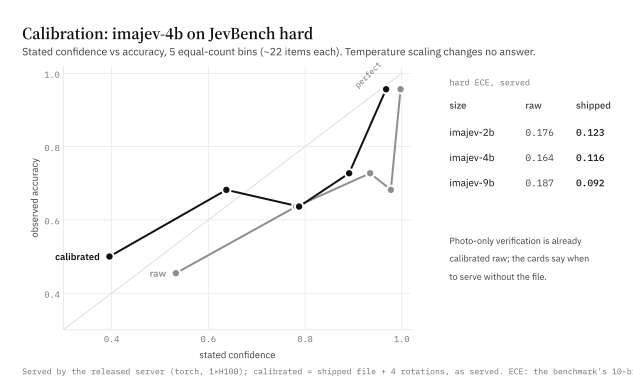</picture>

## Architecture

- **Readout, not generation.** Each option is bound to one of 255 single-token codes. The prompt renders the state, the images and
  the question with its option list, then a decision position; the logits of the option codes (plus the `unknown` code) at that
  position are the decision, read through a float32 head. One prefill per request, one forward pass per question, no decoding.
- **Adapter.** LoRA r16/α32 on all language-model projections (attention, MLP, and the DeltaNet projections in Qwen3.5); the vision
  tower is frozen.
- **Calibration.** Each size ships one temperature (2B 1.646, 4B 1.717, 9B 1.748; fitted by likelihood on 150 authored JevBench-style items, none from JevBench) applied to every question type × option-count
  bucket; the server applies it when started with `--calibration`. Temperature never changes an answer, only its probability.
- **Abstention.** `unknown` is a first-class option in training and inference. Insufficient evidence, a false premise, a mismatched
  reference or an answer outside the listed options all train toward `unknown`.

## How it was made

<p><picture><source media="(prefers-color-scheme: dark)" srcset="docs/assets/readme/training-dark.png">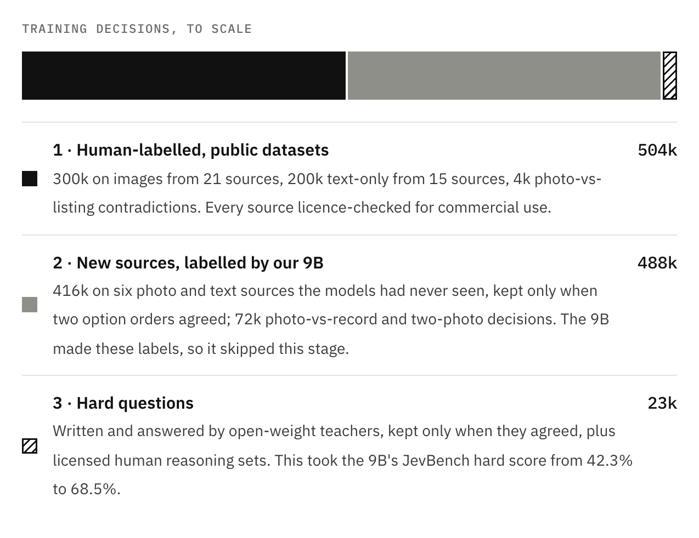</picture></p>

About a million training decisions in four stages, on open base models, for about $676 of rented GPU time for the whole project.
The 2B and 4B went through all four stages (the 4B in one combined run of stages 1 and 2); the 9B, which produced the stage-2
labels, went from stage 1 to stage 3, then stage 4 with the others.

### Training recipe

1. **Licence-checked decisions (the 9B's first stage).** Human-labelled image and text decisions from licence-verified sources,
   including roughly 300k image decisions converted from 21 public vision datasets.
2. **New photo sources and pairs (the 2B and 4B).** An earlier version of imajev-9b, trained on stage 1, labelled 546,964
   decisions on six new photo and text sources, keeping 415,907; a label was kept only when two option orders agreed and the top probability was at
   least 0.6 (or `unknown` at least 0.5). 71,630 state-grounded (photo vs record) and two-image (reference vs target) decisions
   were added (54,468 labelled by the 9B, 17,162 by construction).
3. **Hard typed questions (all sizes).** 17,898 hard typed questions: synthetic documents and questions written by Qwen3.6-27B,
   answered independently by Qwen3.6-27B (thinking) and gpt-oss-20b, kept only on agreement (9,368 of 13,386), plus
   licence-verified human reasoning sets. 2 epochs, lr 3e-5. This is what restored reasoning: the stage-1 recipe had taken the 9B
   from 64.9% (untuned base) to 42.3% on JevBench hard; after these questions it scored 67.6%. The last part of the hard-question
   stage: 2,699 documents → 8,097 questions → 4,852 kept by unanimous agreement of three open-weight answerers (adding
   Qwen3.6-35B-A3B thinking), plus 4,214 replayed earlier hard questions (7,812 training rows). 2 epochs, lr 2e-5, continuing from the
   adapters trained on the earlier hard questions.
4. **Soft targets, then a weight-space average (all sizes).** 39,515 rows: the stage-3 teacher questions relabelled with full probability
   distributions from Qwen3.6-35B-A3B (thinking), 9,880 new hard, judge-style and programmatic questions, 10,570 rows of the Eikos
   decisions dataset (`caiovicentino1/eikos-decisions`, CC-BY-4.0, attribution and per-source licences in `docs/eikos-decisions-usage.md`; only its programmatic and human-annotated rows, nothing labelled by an API model) and 5,000 replayed
   image decisions. Soft cross-entropy on the teacher distribution, a rationale loss (weight 0.3, at most 192 tokens) and option
   permutation; 2 epochs, lr 2e-5, continuing from the stage-3 adapters (2B 620, 4B 747, 9B 1,018 steps). The checkpoint on its own gained on
   JevBench hard but lost photo-plus-record items on ImajevBench, so what ships is the element-wise average of the stage-3 adapter and
   this stage's best checkpoint (LoRA and readout): it keeps the image scores and most of the hard-question gain, and passes every
   release gate (ImajevBench within 1 point of stage 3, visual and joint item counts, probes, correct-unknown rate, false abstention,
   irrelevance).

Every teacher is open-weight. No JevBench items (8-gram contamination lint), no Jev outputs and no paid-API outputs were used in
training. Total rented GPU across the project: about $676 on RunPod.

The pseudo-labelling pipeline (`scripts/v2/pseudo_label.py`) and the hard-question pipeline (`scripts/p2/`) work on your own data.

## Technical specification

| | imajev-2b | imajev-4b | imajev-9b |
|---|---|---|---|
| Base (pinned revision) | Qwen/Qwen3.5-2B @15852e8c | Qwen/Qwen3.5-4B @851bf6e8 | Qwen/Qwen3.5-9B @c2022362 |
| Trainable parameters (LoRA + readout) | 16,152,576 | 31,127,040 | 41,152,512 |
| Adapter file (`adapter_model.safetensors`, F32) | 62.6 MB | 122.0 MB | 160.5 MB |
| Shipped adapter | weight-space average (½ + ½) of two adapters: the hard-question adapter and its soft-target continuation | same | same |
| Readout (bias-free linear, float32) | 255 × 2048, 2.1 MB | 255 × 2560, 2.6 MB | 255 × 4096, 4.2 MB |
| Calibration temperature | 1.646 | 1.717 | 1.748 |
| Base weights to download | 4.6 GB | 9.3 GB | 19.3 GB |

**Data by stage.**

- **Stage 1** (2B, 9B; part of the 4B's first run): 504,000 decisions from 36 licence-admitted sources (15 text, 21 image), including
  4,000 photo-vs-listing contradictions.
- **Stage 2** (2B; part of the 4B's first run of 866,854 decisions; the 9B skipped it): 616,964 decisions labelled by the 9B,
  475,305 kept; 71,630 photo-vs-record and two-photo decisions (17,162 of them labelled by construction).
- **Stage 3** (all sizes), two rounds: 9,368 kept teacher questions plus 8,532 human reasoning items from 10 licensed sets, then
  4,852 kept teacher questions trained with 4,214 replayed round-1 rows.
- **Stage 4** (all sizes): 39,515 soft-target rows: the stage-3 teacher questions relabelled with teacher distributions, 9,880 new hard,
  judge-style and programmatic questions, 10,570 Eikos decisions rows, 5,000 replayed image decisions.

**Training.** LoRA r16/α32 on all language-model projections including DeltaNet (vision tower frozen), AdamW with weight decay 0,
linear warm-up then cosine decay to 10% of the peak, gradient clipping 1.0, 4 GPUs (H100 or H200). Peak learning rates: stage 1
1e-4 for the 2B (after a 2e-4 initial run) and 2e-4 for the 9B; the 4B's first run 1.5e-4; stage 2 5e-5; stage 3 3e-5, then 2e-5; stage 4 2e-5 (soft cross-entropy plus a rationale loss of 0.3, option permutation), followed by the
50/50 weight-space average with the stage-3 adapter.

**Compute.** About $676 of rented GPU time on RunPod for the whole project, every run included: $499.07 through stage 3 and about $177 for
stage 4 (6 h 20 min on one 8×H100 pod).

Full specification: [docs/technical-specification.md](docs/technical-specification.md)

## ImajevBench

JevBench is text-only, so imajev ships a benchmark that is not. ImajevBench v2.0-lite has text-only, visual and joint (photo +
state) items with an explicit Unknown reference; the test split is 279 items in 89 evidence clusters, 21 with an Unknown reference.
It reports cluster-bootstrap CIs and pre-registered paired tests, and ranks direct option scoring and structured generation
separately. It is a **preview**: all images are AI-generated and there has been no human audit yet. Data and datasheet in `bench/`,
harness in `src/imajev_bench`, leaderboard in `bench/LEADERBOARD.md`. Run your model and send the row.

<picture><source media="(prefers-color-scheme: dark)" srcset="docs/assets/charts/uplift-dark.svg">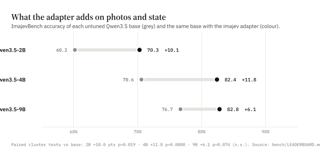</picture>

## Data and licences

- Code and adapters: Apache-2.0. Base models: Qwen3.5-2B, -4B and -9B, Apache-2.0.
- Training data is admitted per source under a verified licence receipt (`scripts/v1_text/common.py`). New photo sources: PD12M
  (CC0), Wikimedia Commons (CC-BY-4.0, CC-BY-3.0 or CC0, checked per file), Open Images (CC-BY-2.0). 16 of the 21 image sources from stage 1 are
  admitted under their annotation licences only, with the photos remaining under their upstream terms (not redistributed); for abo,
  vizwiz, vizwiz_quality and defects the grant covers the images too. The receipts
  and the per-source table are in `results/`.
- No Jev outputs, no paid-API outputs and no benchmark test items were used in training. JevBench and typed-decisions test items
  were only ever evaluated on.
- The models output probabilities over options you supply. They are not a safety, medical, legal or hiring certificate.

## Limitations

- **Single pass, no reasoning at inference.** JevBench hard trails reasoning models; JevK5 and Eikos-4B are ahead of every size.
- **Over-confident without calibration.** Raw hard-item ECE is 0.16–0.19 (0.09–0.12 as shipped); serve with `--calibration` and `--rotations 4`.
- **Photo-only caveat.** On photo-only verification (ABO + VizWiz) the raw probabilities are already calibrated and a single
  temperature over-softens them (previous adapters and temperatures: 4B 0.038 → 0.062, 9B 0.027 → 0.053; not re-measured). For mostly photo-against-record traffic, serve without
  `--calibration` or fit your own temperature.
- **The last part of the hard-question stage cost some reasoning-dev accuracy** on our reasoning dev set (also used for checkpoint selection): 2B −5.6, 4B −1.2, 9B −1.8 points; the stage-4 checkpoints recovered most of it (62.7 / 67.2 / 68.9%), and the shipped averages were not measured on it.
- **Our pre-registered test against the untuned base model is not significant for the 9B** (+5.4 points over its untuned base, p = 0.131, on the shipped adapter; +6.1, p = 0.074 on the previous one), and the 4B and 9B are statistically indistinguishable on ImajevBench.
- **The 2B abstains too rarely on ImajevBench's Unknown items** (5/21, vs 14/21 and 15/21 for the 4B and 9B). The ImajevBench test split was
  also an input to choosing the shipped checkpoints (the release gates), so its numbers are not pure held-out estimates; on the hidden
  split (202 items, never published item by item) the shipped models score 74.3 / 84.2 / 84.7%.
- **An empty field can read as "no".** In the checked text app, a blank payment note was answered "not paid" (P = 0.06) instead of
  unknown. Unknown is trained for missing evidence, not guaranteed.
- **Scribbles read as letters.** The tracing pad reads 20 of 20 traced characters but calls 8 of 10 scribbles a letter.
- **Two-image comparison is the weakest visual task** (an earlier imajev-4b, before the hard-question stage: 41.8% on real pairs; not re-run on the released adapters).
- English only; at most two images, 32 KB state, 254 options, 8 questions per request. ImajevBench images are AI-generated.

## Repository map

- `src/vision_decision/` request contracts, MLX backend, Jev API translation, calibration.
- `scripts/playground/` the local server and the playground UI.
- `scripts/train_decision_lora_torch.py`, `scripts/torch_decision.py` training and the PyTorch path.
- `scripts/v2/` data collection, templates and the 9B pseudo-labelling pipeline.
- `scripts/p2/` hard typed-question generation, answering, assembly and temperature fitting.
- `src/imajev_bench/`, `bench/` the benchmark.
- `results/` every evaluation we report: `results/imajev-1.0/` (the released models, their calibration files and release gates; `phase-2b/` holds the previous adapters and their earlier paired tests), `results/benchmarks/`
  (JevBench and ImajevBench runs), plus reports on earlier checkpoints (`results/earlier-checkpoints/`).
- `docs/` specs and the run book.

## Citation

See `CITATION.cff`.

## Acknowledgements

Qwen3.5 (Alibaba) for the base models; Qwen3.6 and gpt-oss (OpenAI) as open-weight teachers; TypeSafe's Jev documentation for the
request contract this project mirrors; JevBench (fstandhartinger/jevbench) for the public text splits; kev (jaredpalmer/kev) as the
sibling text-only project whose recipe notes were useful; PD12M (Spawning), Wikimedia Commons and Open Images for photos.
